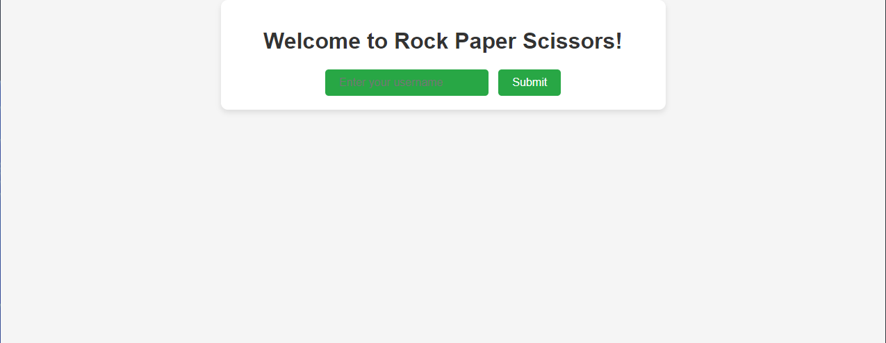
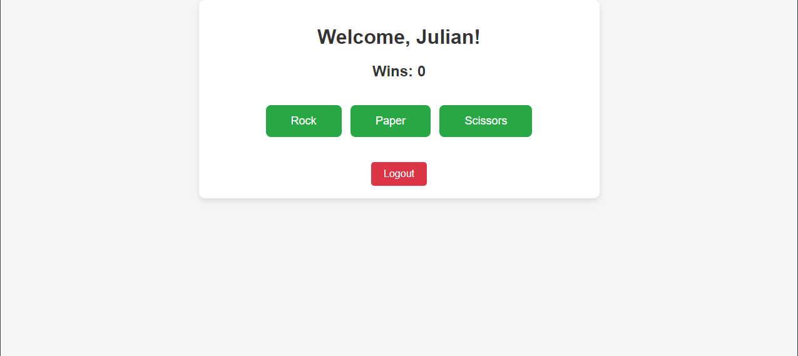

# Rock Paper Scissors Web App

Welcome to the Rock Paper Scissors web application! This Flask-based web app allows users to play the classic game of Rock Paper Scissors against the computer. Users can set a username, track their wins, and enjoy a fun gaming experience.

## Features

- **User Authentication**: Users can set a username to play the game. Case sensitivity is ignored when logging in.
- **Gameplay**: Users can choose between rock, paper, or scissors and play against the computer.
- **Wins Tracking**: The application tracks the number of wins for each user, preventing duplicate wins.
- **Responsive Design**: The UI is designed to be responsive and works well on various devices.

## Technologies Used

- **Flask**: Python web framework used for building the backend.
- **SQLite**: Lightweight database management system used for storing user data.
- **HTML/CSS**: Frontend design and styling.

## Setup

1. Clone the repository:

   ```
   git clone https://github.com/klmnjulian/rps-web.git
   ```

2. Install dependencies:

   ```
   pip install -r requirements.txt
   ```

3. Run the Flask application:

   ```
   python app.py
   ```

4. Access the web app in your browser:

   ```
   http://localhost:5000
   ```

## Screenshots





## Contributing

Contributions are welcome! If you'd like to contribute to this project, please fork the repository and submit a pull request.

## License

This project is licensed under the MIT License - see the [LICENSE](LICENSE) file for details.
